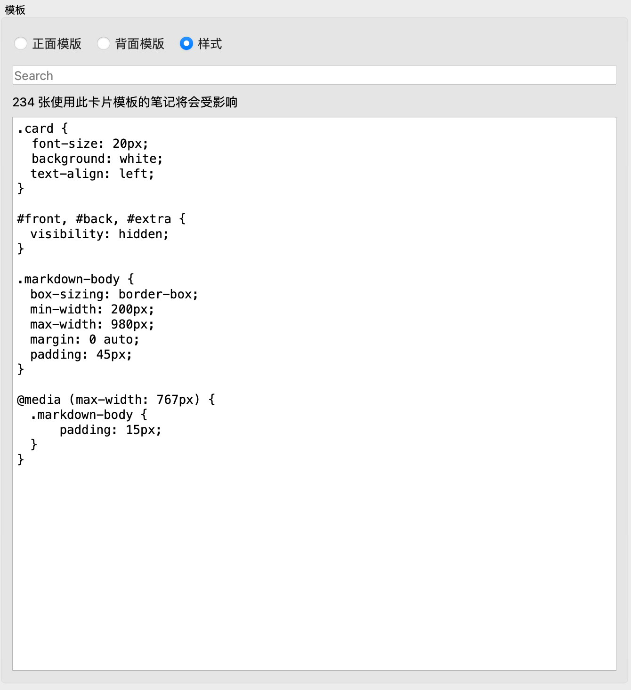
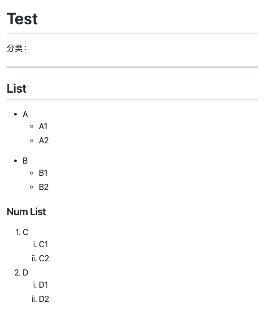

# Anki-md-github
This is an anki card template with markdown support using github markdown style.

## How to use 
### Use apkg
1. Download the apkg in release.
2. Create cards use template `KaTeX and Markdown Basic`

### Alter by yourself
1. Install `Anki-KaTeX-Markdown` addon.
2. Download `_github-markdown.css` and place it to account media folder.
3. Edit card template 
    1. Front 
        1. Surround contents with class `markdown-body`
	    2. Import `_github-markdown.css` file.
		
    2. Back 
	
		Same as Front
		
	3. Style
		
		Add this two attributes.
		```css
		.markdown-body {
			box-sizing: border-box;
			min-width: 200px;
			max-width: 980px;
			margin: 0 auto;
			padding: 45px;
		}

		@media (max-width: 767px) {
			.markdown-body {
				padding: 15px;
			}
		}
		```
		

## Preview 
1. List

2. Link Quote Code Table

3. Formular Base64 images


## Reference
[Jwrede/Anki-KaTeX-Markdown](https://github.com/Jwrede/Anki-KaTeX-Markdown)

[sindresorhus/github-markdown-css](https://github.com/sindresorhus/github-markdown-css)
