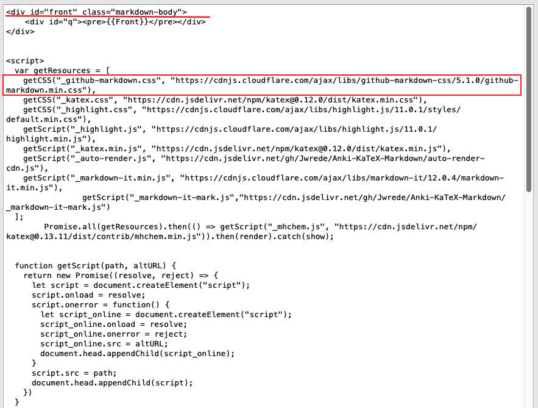
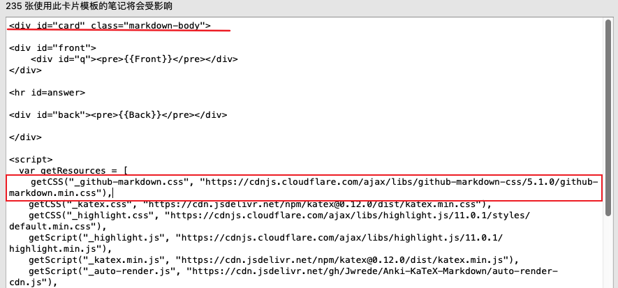
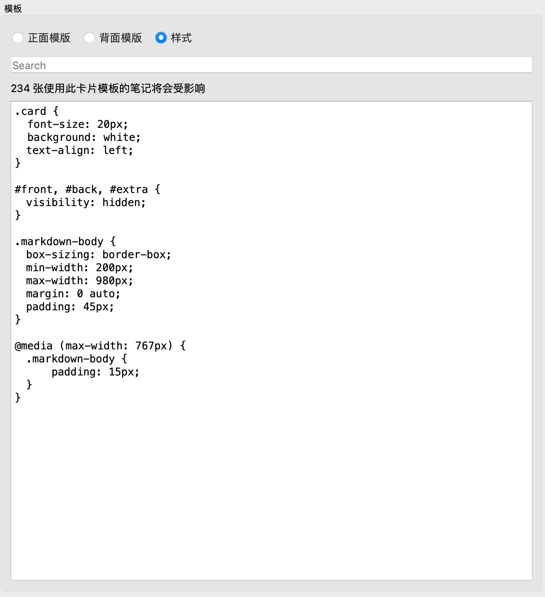
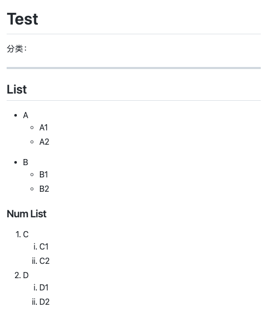
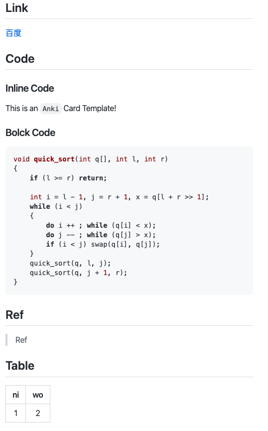

# Anki-md-github
支持Github Markdown样式的Anki卡片模板，修改自Anki-KaTeX-Markdown。

## 使用指南
### 直接使用牌组包
1. 在release下载牌组包
2. 用模板`KaTeX and Markdown Basic`创建新卡片

### 自行修改模板
1. 安装`Anki-KaTeX-Markdown`插件
2. 下载 `_github-markdown.css` 样式文件，放到媒体文件目录.
3. 修改卡片样式
    1. Front 
		1. 将`Front`用class为`markdown-body`的标签包围起来。
	    2. 修改下方的JS导入`_github-markdown.css`样式文件.
		
    2. Back 
	
		与`Front`同样的操作
		
	3. Style
		
		加入两个限制页面宽度的属性。
		```css
		.markdown-body {
			box-sizing: border-box;
			min-width: 200px;
			max-width: 980px;
			margin: 0 auto;
			padding: 45px;
		}

		@media (max-width: 767px) {
			.markdown-body {
				padding: 15px;
			}
		}
		```
		

## 效果展示 
1. 列表

2. 链接、引用、代码高亮、表格

3. 公式、Base64编码的图片支持


## Reference
[Jwrede/Anki-KaTeX-Markdown](https://github.com/Jwrede/Anki-KaTeX-Markdown)

[sindresorhus/github-markdown-css](https://github.com/sindresorhus/github-markdown-css)
